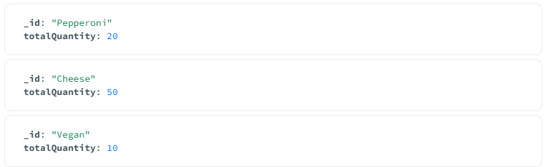
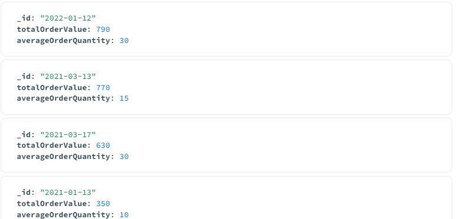
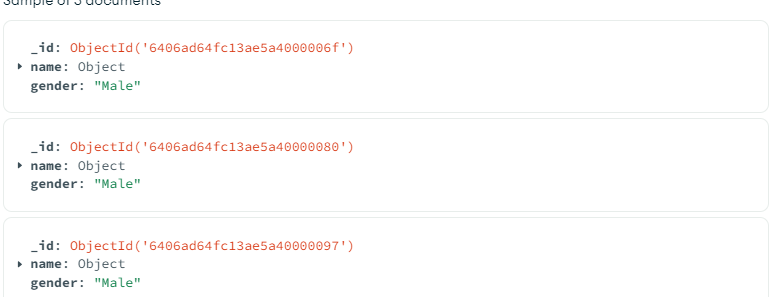
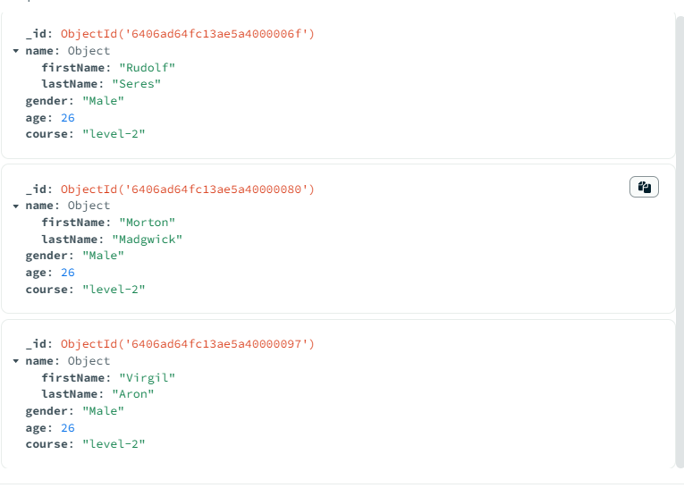
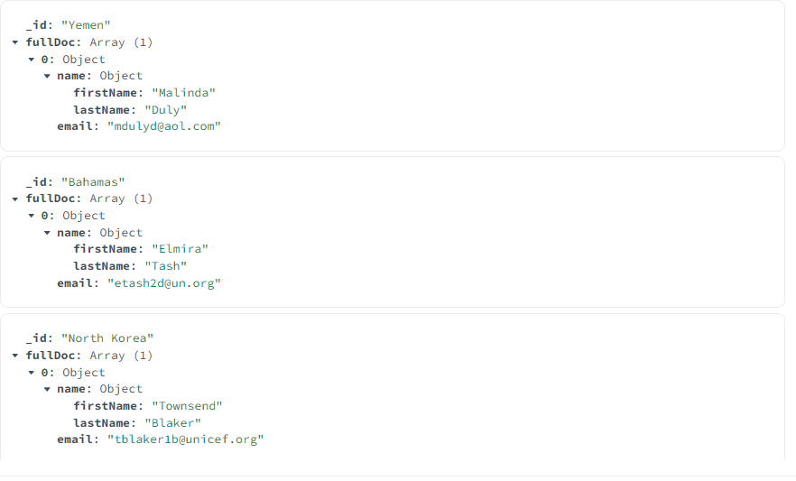
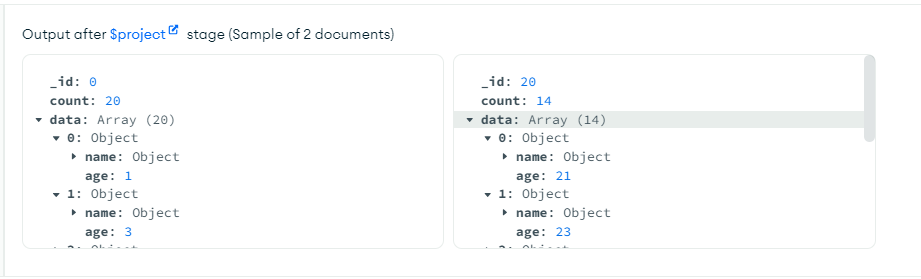
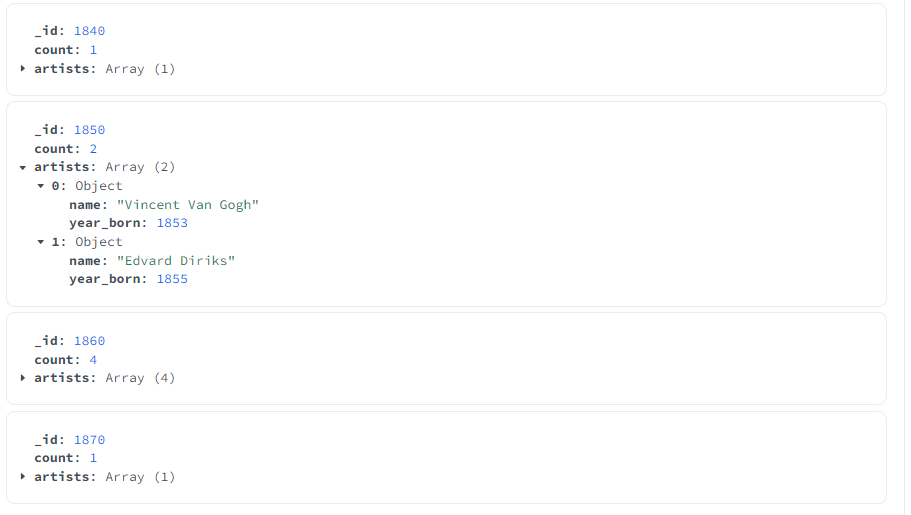
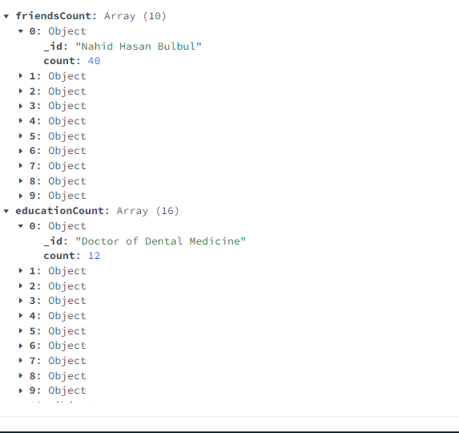
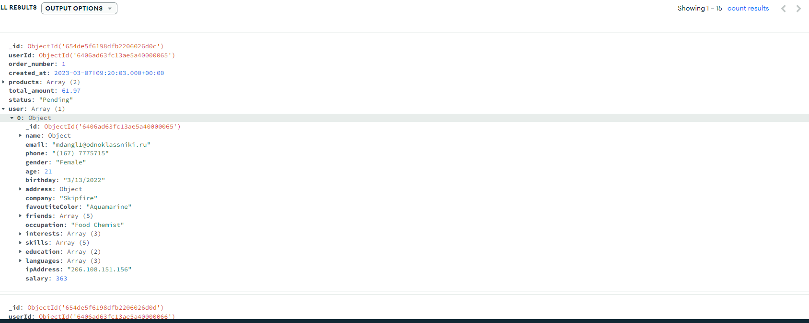

# Aggregation

## Index

- [Introduction](#introduction)
- [Aggregation by $match](#aggregation-by-match)
- [Calculate Total Order Value and Average Order Quantity](#calculate-total-order-value-and-average-order-quantity)
- [$project](#project)
  - [$addField](#addfield)
  - [$out and $merge](#out-and-merge)
- [$group, $sum, $push](#group-sum-push)
  - [Accumulator(group) operator -$max, $min, $avg](#accumulatorgroup-operator-max-min-avg)
- [$unwind](#unwind)
- [$bucket, $sort, and $limit](#bucket-sort-and-limit)
  - [Breakdown of the above code](#breakdown-of-the-above-code)
  - [another example of $bucket](#another-example-of-bucket)
- [$facet, multiple pipeline aggregation stage](#facet-multiple-pipeline-aggregation-stage)
- [embedding vs referencing](#embedding-vs-referencing)
- [$lookup for referencing](#lookup-for-referencing)
- [Indexing](#indexing)

## Introduction

Aggregation operations process multiple documents and return computed results. You can use aggregation operations to:

- Group values from multiple documents together.
- Perform operations on the grouped data to return a single result.
- Analyze data changes over time.

## Aggregation by $match

```javascript
db.getCollection("orders").aggregate([
 { $match: { size: "medium" } },
 {
  $group: {
   _id: "$name",
   totalQuantity: { $sum: "$quantity" },
  },
 },
]);
```

**output**



## Calculate Total Order Value and Average Order Quantity

```javascript
db.getCollection("orders")[
 // Stage 1: Filter pizza order documents by date range
 {
  $match: {
   date: {
    $gte: new ISODate("2020-01-30"),
    $lt: new ISODate("2022-01-30"),
   },
  },
 },
 // Stage 2: Group remaining documents by date and calculate results
 {
  $group: {
   _id: {
    $dateToString: {
     format: "%Y-%m-%d",
     date: "$date",
    },
   },
   totalOrderValue: {
    $sum: {
     $multiply: ["$price", "$quantity"],
    },
   },
   averageOrderQuantity: { $avg: "$quantity" },
  },
 },
 // Stage 3: Sort documents by totalOrderValue in descending order
 {
  $sort: { totalOrderValue: -1 },
 },
];
```

**output**



## $project

```javascript
db.getCollection("test").aggregate([
 {
  $match: {
   gender: "Male",
   age: { $gt: 20, $lt: 30 },
  },
 },
 { $project: { name: 1, gender: 1 } },
]);
```

**output**



### $addField

```javascript
db.getCollection("test").aggregate([
 {
  $match: {
   gender: "Male",
   age: { $gt: 20, $lt: 30 },
  },
 },

 {
  $addFields: {
   course: "level-2",
  },
 },

 {
  $project: {
   name: 1,
   gender: 1,
   age: 1,
   course: 1,
  },
 },
]);
```

**output**



### $out and $merge

```javascript
/* applicable to the above code */
 { $out: "course-stuednt" },  /* Creates new collection */
 { $merge: "tests" },  /* merges with the current collection */

```

## $group, $sum, $push

```javascript
db.getCollection("test").aggregate([
 [
  /*stagge -1  */
  {
   $group: {
    _id: "$address.country", //to address a field use $field_name
    count: { $sum: 1 }, // returns number of the matched elements based on the _id
    // name: {$push : ("$name")}, // returns name: {name field of the collection}
    fullDoc: { $push: "$$ROOT" }, //$$root sends all the matching data into an array
   },
  },
  /*stage-2  */
  {
   $project: {
    "fullDoc.name": 1,
    "fullDoc.email": 1,
   },
  },
 ],
]);
```

**output**



[Click here](https://www.mongodb.com/docs/manual/reference/operator/aggregation/group/#considerations) to know the $group operators

## Accumulator(group) operator $max, $min, $avg

```javascript
db.getCollection("test").aggregate[
  /*Accumulator operators can only by used inside group  */
  {
    $group: {
      _id: null,
      totalSalary: {
        $sum: "$salary",
      },
      max: {
        $max: "$salary",
      },
      min: {
        $min: "$salary",
      },
      avg: {
        $avg: "$salary",
      },
    },
  },
  {
    $addFields: {
      avgRounded: {
        $round: ["$avg", 2],
      }, // we can't perform the $round operation in $ group, because $round is not an accumulator operator. Remember only accumulator operator can be used in $group
      diff: { $subtract: ["$max", "$min"] },
    },
  },
]
```

## $unwind

```javascript
db.getCollection("test").aggregate[
  {
    $unwind: "$friends",
  },

  {
    $group: {
      _id: "$friends",
      count: {
        $sum: 1,
      },
      name: {$push : "$name"}
    },
  },
]
```

**output**


## $bucket, $sort, and $limit

```javascript
db.getCollection("test").aggregate[
  {
    $bucket: {
      groupBy: "$age",
      boundaries: [0, 20, 40, 60, 80],
      default: "over 80",
      output: {
        data: {
          $push: {
            $arrayToObject: [
              [
                {
                  k: "name",
                  v: "$name",
                },
                {
                  k: "age",
                  v: "$age",
                },
              ],
            ],
          },
        },
        count: {
          $sum: 1,
        },
      },
    },
  },
  {
    $unwind: "$data",
  },
  {
    $sort: {
      "data.age": 1,
    },
  },
  {
    $group: {
      _id: "$_id",
      count: {
        $first: "$count",
      },
      data: {
        $push: "$data",
      }, // Push the sorted data back into an array
    },
  },
  {
    $sort: {
      _id: 1,
    },
  },
  {
    $limit: 2,
  },
  {
    $project: {
      _id: 1,
      count: 1,
      data: 1,
    },
  },
]
```

**Breakdown of the above code**

1. **`$bucket` Stage:**

   - Groups documents into buckets based on the specified boundaries of the `age` field.
   - Constructs the `data` field using `$arrayToObject` to create an array of objects `{name, age}` for each document within each bucket.
   - Calculates the number of documents in each bucket with the `count` field.

2. **`$unwind` Stage:**

   - Deconstructs the `data` array, creating a separate document for each element in the array.
   - Facilitates sorting the documents based on the `age` field within the `data` array.

3. **`$sort` Stage:**

   - Sorts the documents based on the `age` field within the `data` array in ascending order.

4. **`$group` Stage:**

   - Regroups the documents based on the `_id` field (the bucket identifier) while maintaining the sorted order within the `data` array.
   - Reconstructs the `count` field using `$first` to keep the count value for each bucket.

5. **`$sort` Stage:**

   - Sorts the buckets based on the `_id` field (the original bucket identifier) in ascending order.

6. **`$limit` Stage:**

   - Limits the number of documents in the output to 2.

7. **`$project` Stage:**
   - Projects the specified fields (`_id`, `count`, and `data`) into the final output.

**output**



**another example of $bucket**

```javascript
db.getCollection("artists").aggregate([
 {
  $bucket: {
   groupBy: "$year_born",
   boundaries: [1840, 1850, 1860, 1870, 1880],
   default: "other",
   output: {
    count: { $sum: 1 },
    artists: {
     $push: {
      name: {
       $concat: ["$first_name", " ", "$last_name"],
      },
      year_born: "$year_born",
     },
    },
   },
  },
 },
]);
```

**output**



## $facet, multiple pipeline aggregation stage

`$facet` enables multiple pipelines on same data at once.

```javascript
db.getCollection("test").aggregate([
 {
  $facet: {
   /*pipeline -1  */
   friendsCount: [
    //stage-1
    { $unwind: "$friends" },
    //stage-2
    {
     $group: {
      _id: "$friends",
      count: { $sum: 1 },
     },
    },
   ],
   /*pipeline -2  */
   educationCount: [
    // stage -1
    { $unwind: "$education" },
    // stage-2
    {
     $group: {
      _id: "$education.degree",
      count: { $sum: 1 },
     },
    },
   ],
  },
 },
]);
```

**output**



## embedding vs referencing

### Embedded

- One-to-one Relationships
- Frequent Reading Data
- Small Data Size
- Atomic Updates

### Referencing

- One-to-Many Relationships
- Many-to-Many
- Frequent writing
- Big Data size
- Scalability
- Flexibility

## $lookup for referencing

```javascript
db.getCollection("practice_orders").aggregate([
 {
  $lookup: {
   from: "test",
   localField: "userId",
   foreignField: "_id",
   as: "user",
  },
 },
]);
```

**output**



## Indexing

**Create Index**

```javascript
db.test.createIndex({ gender: 1 });
```

**Drop Index**

```javascript
db.test.createIndex.dropIndex({ email: 1 });
```

**Compound Index**

```javascript
db.test.createIndex({ gender: 1, age: -1 });
```

**Text Index**

```javascript
db.test.createIndex({ about: "text" });
```

**find through text index**

```javascript
db.test.find({ $text: { $search: "dolor" } });
```
