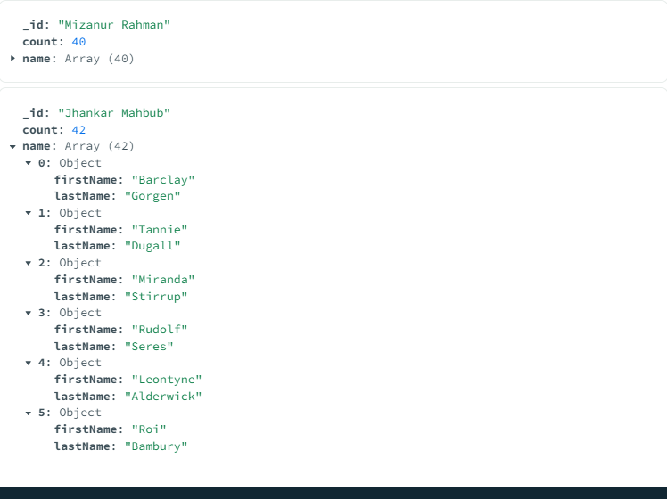

# Aggregation

## Index

- [Introduction](#introduction)
- [Aggregation by $match](#aggregation-by-match)
- [Calculate Total Order Value and Average Order Quantity](#calculate-total-order-value-and-average-order-quantity)
- [$project](#project)
  - [$addField](#addfield)
  - [$out and $merge](#out-and-merge)
- [$group, $sum, $push](#group-sum-push)
  - [Accumulator(group) operator -$max, $min, $avg](#accumulatorgroup-operator-max-min-avg)
- [$unwind](#unwind)
- [$bucket, $sort, and $limit](#bucket-sort-and-limit)
- [$facet, multiple pipeline aggregation stage](#facet-multiple-pipeline-aggregation-stage)
- [embedding vs referencing](#embedding-vs-referencing)
- [$lookup for referencing](#lookup-for-referencing)
- [Indexing](#indexing)
- [FAQ](#faq)

## Introduction

Aggregation operations process multiple documents and return computed results. You can use aggregation operations to:

- Group values from multiple documents together.
- Perform operations on the grouped data to return a single result.
- Analyze data changes over time.

## Aggregation by $match

**$match:** In MongoDB, $match is a pipeline stage in aggregation that filters documents based on specified criteria, similar to a query using find().

```javascript
db.getCollection("orders").aggregate([
  { $match: { size: "medium" } },
  {
    $group: {
      _id: "$name",
      totalQuantity: { $sum: "$quantity" },
    },
  },
]);
```

**Explanation**

- **Stage 1 –** **$match**:
  - Filters the documents to include only those where the size is "medium".
- **Stage 2 –** **$group**:
  - Groups the filtered documents by the name field.
  - For each group, it calculates the totalQuantity by summing up the quantity values.
- **Result**: A list of items (name) with the total quantity ordered for size "medium".

**output**


## Calculate Total Order Value and Average Order Quantity

**$group:** In MongoDB, `$group` is used to group documents by a specified field and perform aggregations like sum, average, count, etc., on each group.

```javascript
db.getCollection("orders")[
 // Stage 1: Filter pizza order documents by date range
 {
  $match: {
   date: {
    $gte: new ISODate("2020-01-30"),
    $lt: new ISODate("2022-01-30"),
   },
  },
 },
 // Stage 2: Group remaining documents by date and calculate results
 {
  $group: {
   _id: {
    $dateToString: {
     format: "%Y-%m-%d",
     date: "$date",
    },
   },
   totalOrderValue: {
    $sum: {
     $multiply: ["$price", "$quantity"],
    },
   },
   averageOrderQuantity: { $avg: "$quantity" },
  },
 },
 // Stage 3: Sort documents by totalOrderValue in descending order
 {
  $sort: { totalOrderValue: -1 },
 },
];
```

**Explanation**

- **Stage 1 –** `$match`:
  - Filters orders to include only those between January 30, 2020 and January 30, 2022.
- **Stage 2 –** `$group`:
  - Groups the filtered documents by date (formatted as `YYYY-MM-DD`).
  - Calculates `totalOrderValue` by multiplying `price` and `quantity` for each document and summing them.
  - Calculates the average quantity of items ordered (`averageOrderQuantity`) for each date.
- **Stage 3 –** `$sort`:
  - Sorts the grouped results in descending order based on `totalOrderValue`.

**output**


## $project

**$project:** In MongoDB, `$project` is used to include, exclude, or reshape fields in the output documents.

```javascript
db.getCollection("test").aggregate([
  {
    $match: {
      gender: "Male",
      age: { $gt: 20, $lt: 30 },
    },
  },
  { $project: { name: 1, gender: 1 } },
]);
```

**Explanation**

- **Stage 1 –** `$match`:
  - Filters documents to include only males (`gender: "Male"`) whose age is greater than 20 and less than 30.
- **Stage 2 –** `$project`:
  - Includes only the `name` and `gender` fields in the output.
  - All other fields (like `age`, `_id`, etc.) are excluded by default unless explicitly included.

**output**


### $addField

**$addFields:** In MongoDB, `$addFields` is used to add new fields or update existing fields in documents within the aggregation pipeline.

```javascript
db.getCollection("test").aggregate([
  {
    $match: {
      gender: "Male",
      age: { $gt: 20, $lt: 30 },
    },
  },

  {
    $addFields: {
      course: "level-2",
    },
  },

  {
    $project: {
      name: 1,
      gender: 1,
      age: 1,
      course: 1,
    },
  },
]);
```

**Explanation**

- **Stage 1 –** `$match`:
  - Filters documents to include only males between ages 21 and 29.
- **Stage 2 –** `$addFields`:
  - Adds a new field `course` with the value `"level-2"` to each document.
- **Stage 3 –** `$project`:
  - Outputs only the `name`, `gender`, `age`, and `course` fields for each document.

**output**


### `$out` and `$merge`

```javascript
/* applicable to the above code */
 { $out: "course-stuednt" },  /* Creates new collection */
 { $merge: "tests" },  /* merges with the current collection */

```

## `$group`, `$sum`, `$push`

**$sum:** In MongoDB, `$sum`calculates the total of numeric values or counts documents when used with a constant like`1`.

**$push:** In MongoDB, `$push` adds values to an array, collecting data from multiple documents into a single array field in the group.

```javascript
db.getCollection("test").aggregate([
  [
    /*stagge -1  */
    {
      $group: {
        _id: "$address.country", //to address a field use $field_name
        count: { $sum: 1 }, // returns number of the matched elements based on the _id
        // name: {$push : ("$name")}, // returns name: {name field of the collection}
        fullDoc: { $push: "$$ROOT" }, //$$root sends all the matching data into an array
      },
    },
    /*stage-2  */
    {
      $project: {
        "fullDoc.name": 1,
        "fullDoc.email": 1,
      },
    },
  ],
]);
```

**Explanation**

- **Stage 1 –** `$group`:
  - Groups documents by the value of `address.country`.
  - `count` sums 1 for each document in the group to count total documents per country.
  - `fullDoc` collects entire matching documents into an array using `$push` and `$$ROOT`.
- **Stage 2 –** `$project`:
  - Displays only the `name` and `email` fields from each document inside the `fullDoc` array.

**output**


[Click here](https://www.mongodb.com/docs/manual/reference/operator/aggregation/group/#considerations) to know the $group operators

## Accumulator(group) operator `$max`, `$min`, `$avg`

**Accumulator Operator:** In MongoDB, accumulator operators are used within the `$group` stage to perform calculations like sum, average, min, max, etc., on grouped data.

**$max:** In MongoDB, `$max` returns the highest value from a group of documents.

**$min:** In MongoDB, `$min` returns the lowest value from a group of documents.

**$avg:** In MongoDB, `$avg` calculates the average (mean) value from a group of documents.

```javascript
db.getCollection("test").aggregate[
  /*Accumulator operators can only by used inside group  */
  {
    $group: {
      _id: null,
      totalSalary: {
        $sum: "$salary",
      },
      max: {
        $max: "$salary",
      },
      min: {
        $min: "$salary",
      },
      avg: {
        $avg: "$salary",
      },
    },
  },
  {
    $addFields: {
      avgRounded: {
        $round: ["$avg", 2],
      }, // we can't perform the $round operation in $ group, because $round is not an accumulator operator. Remember only accumulator operator can be used in $group
      diff: { $subtract: ["$max", "$min"] },
    },
  },
]
```

**Explanation**

- **Stage 1 –** `$group`:
  - Groups all documents together using `_id: null`.
  - Calculates `totalSalary` by summing all `salary` values.
  - Finds the maximum salary using `$max`.
  - Finds the minimum salary using `$min`.
  - Calculates the average salary using `$avg`.
- **Stage 2 –** `$addFields`:
  - Adds `avgRounded` by rounding the average salary to 2 decimal places.
  - Adds `diff`, which is the difference between the maximum and minimum salaries.

## $unwind

**$unwind:** In MongoDB, `$unwind` deconstructs an array field from the input documents to output a document for each element.

```javascript
db.getCollection("test").aggregate[
  {
    $unwind: "$friends",
  },

  {
    $group: {
      _id: "$friends",
      count: {
        $sum: 1,
      },
      name: {$push : "$name"}
    },
  },
]
```

**Explanation**

- **Stage 1 –** `$unwind`:
  - Breaks each document's `friends` array into multiple documents, one for each friend.
- **Stage 2 –** `$group`:
  - Groups documents by each friend (now a single value due to `$unwind`).
  - Counts how many times each friend appears.
  - Collects all corresponding `name` values into an array.

**output**



## `$bucket`, `$sort`, and `$limit`

**$bucket:** In MongoDB, `$bucket` groups documents into buckets (ranges) based on a specified field.

**$sort:** In MongoDB, `$sort` arranges the documents in ascending or descending order based on field values.

**$limit:** In MongoDB, `$limit` restricts the number of documents passed to the next stage.

```javascript
db.getCollection("test").aggregate[
  {
    $bucket: {
      groupBy: "$age",
      boundaries: [0, 20, 40, 60, 80],
      default: "over 80",
      output: {
        data: {
          $push: {
            $arrayToObject: [
              [
                {
                  k: "name",
                  v: "$name",
                },
                {
                  k: "age",
                  v: "$age",
                },
              ],
            ],
          },
        },
        count: {
          $sum: 1,
        },
      },
    },
  },
  {
    $unwind: "$data",
  },
  {
    $sort: {
      "data.age": 1,
    },
  },
  {
    $group: {
      _id: "$_id",
      count: {
        $first: "$count",
      },
      data: {
        $push: "$data",
      }, // Push the sorted data back into an array
    },
  },
  {
    $sort: {
      _id: 1,
    },
  },
  {
    $limit: 2,
  },
  {
    $project: {
      _id: 1,
      count: 1,
      data: 1,
    },
  },
]
```

**Breakdown of the above code**

1. **`$bucket` Stage:**

   - Groups documents into buckets based on the specified boundaries of the `age` field.
   - Constructs the `data` field using `$arrayToObject` to create an array of objects `{name, age}` for each document within each bucket.
   - Calculates the number of documents in each bucket with the `count` field.

2. **`$unwind` Stage:**

   - Deconstructs the `data` array, creating a separate document for each element in the array.
   - Facilitates sorting the documents based on the `age` field within the `data` array.

3. **`$sort` Stage:**

   - Sorts the documents based on the `age` field within the `data` array in ascending order.

4. **`$group` Stage:**

   - Regroups the documents based on the `_id` field (the bucket identifier) while maintaining the sorted order within the `data` array.
   - Reconstructs the `count` field using `$first` to keep the count value for each bucket.

5. **`$sort` Stage:**

   - Sorts the buckets based on the `_id` field (the original bucket identifier) in ascending order.

6. **`$limit` Stage:**

   - Limits the number of documents in the output to 2.

7. **`$project` Stage:**

   - Projects the specified fields (`_id`, `count`, and `data`) into the final output.

**output**


**another example of $bucket**

```javascript
db.getCollection("artists").aggregate([
  {
    $bucket: {
      groupBy: "$year_born",
      boundaries: [1840, 1850, 1860, 1870, 1880],
      default: "other",
      output: {
        count: { $sum: 1 },
        artists: {
          $push: {
            name: {
              $concat: ["$first_name", " ", "$last_name"],
            },
            year_born: "$year_born",
          },
        },
      },
    },
  },
]);
```

**Explanation**

- **Stage 1 –** `$bucket`:
  - Groups documents based on the `age` field into defined ranges: `[0–20)`, `[20–40)`, `[40–60)`, `[60–80)`.
  - Documents with `age >= 80` are grouped into a bucket labeled `"over 80"`.
  - For each bucket:
    - `data`: pushes simplified objects containing only `name` and `age`.
    - `count`: tracks the number of documents in each bucket.
- **Stage 2 –** `$unwind`:
  - Flattens the `data` array in each bucket, creating a separate document for each item in the array.
- **Stage 3 –** `$sort`:
  - Sorts the unwound `data` documents by `data.age` in ascending order.
- **Stage 4 –** `$group`:
  - Re-groups the documents by the original bucket `_id`.
  - Retains the original `count` using `$first`.
  - Pushes the sorted `data` entries back into an array.
- **Stage 5 –** `$sort`:
  - Sorts the grouped buckets by `_id` in ascending order.
- **Stage 6 –** `$limit`:
  - Restricts the output to only the first 2 buckets.
- **Stage 7 –** `$project`:
  - Selects only `_id`, `count`, and `data` fields for final output.

**output**


## $facet, multiple pipeline aggregation stage

**$facet:** In MongoDB, `$facet` enables running multiple aggregation pipelines in parallel on the same input data.

```javascript
db.getCollection("test").aggregate([
  {
    $facet: {
      /*pipeline -1  */
      friendsCount: [
        //stage-1
        { $unwind: "$friends" },
        //stage-2
        {
          $group: {
            _id: "$friends",
            count: { $sum: 1 },
          },
        },
      ],
      /*pipeline -2  */
      educationCount: [
        // stage -1
        { $unwind: "$education" },
        // stage-2
        {
          $group: {
            _id: "$education.degree",
            count: { $sum: 1 },
          },
        },
      ],
    },
  },
]);
```

**Explanation**

- **Stage 1 –** `$facet`:
  - Runs two independent pipelines on the same dataset:
    - **Pipeline 1 – `friendsCount`** :
      - `$unwind`: Flattens the `friends` array to work with individual friend entries.
      - `$group`: Groups by each unique friend and counts how often each appears.
    - **Pipeline 2 – `educationCount`** :
      - `$unwind`: Flattens the `education` array.
      - `$group`: Groups by `education.degree` and counts how many times each degree occurs.
- **Result** : Returns an object with two arrays: `friendsCount` and `educationCount`, each containing the grouped and counted results from their respective pipelines.

**output**


## embedding vs referencing

### Embedded

- One-to-one Relationships
- Frequent Reading Data
- Small Data Size
- Atomic Updates

### Referencing

- One-to-Many Relationships
- Many-to-Many
- Frequent writing
- Big Data size
- Scalability
- Flexibility

## $lookup for referencing

**$lookup:** In MongoDB, `$lookup` performs a left outer join to combine documents from two collections based on matching field values.

```javascript
db.getCollection("practice_orders").aggregate([
  {
    $lookup: {
      from: "test",
      localField: "userId",
      foreignField: "_id",
      as: "user",
    },
  },
]);
```

**Explanation**

- **Stage 1 –** `$lookup`:
  - Joins documents from the `"practice_orders"` collection with documents from the `"test"` collection.
  - Matches `"userId"` in `"practice_orders"` with `"_id"` in `"test"`.
  - Adds a new array field `"user"` to each `"practice_orders"` document containing matched `"test"` documents.

**output**


## Indexing

**Create Index:**

```javascript
db.test.createIndex({ gender: 1 });
```

Creates an ascending index on the `gender` field to speed up queries involving `gender`

**Drop Index:**

```javascript
db.test.createIndex.dropIndex({ email: 1 });
```

Removes the existing index on the `email` field.\*_Drop Index_

**Compound Index:**

```javascript
db.test.createIndex({ gender: 1, age: -1 });
```

Creates a multi-field index on `gender` (ascending) and `age` (descending) to optimize queries filtering/sorting on both fields.\*_Compound Index_

**Text Index:**

```javascript
db.test.createIndex({ about: "text" });
```

Creates a text index on the `about` field to enable full-text search.\*_Text Index_

**Find through Text Index:**

```javascript
db.test.find({ $text: { $search: "dolor" } });
```

Searches for the word `"dolor"` in fields covered by a text index.\*_find through text index_

## FAQ

- **Can we read, update or delete in aggregation in Mongodb?**

  _The MongoDB aggregation framework is primarily designed for data transformation and analysis, not for directly reading, updating, or deleting documents. The aggregation pipeline processes data in a series of stages, allowing you to filter, transform, and manipulate data, but it does not modify the original documents in the underlying collection._

- **How to perform `$text` search in aggregation pipleine?**

  _The following aggregation searches for the term `cake` in the `$match` stage and calculates the total views for the matching documents in the $group stage._

  ```javascript
  db.articles.aggregate([
    {
      $match: {
        $text: { $search: "cake" },
      },
    },

    {
      $group: {
        _id: null,
        views: { $sum: "$views" },
      },
    },
  ]);
  ```
